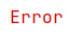
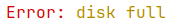
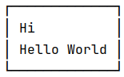

# ansi-styling-library

A zero-dependency Java library for styling terminal text with colors and attributes through a fluent API.

```java
Ansi.foreground(Style.Color.RED).bold().apply("Error");
```

## Features

* Colors (8 foreground, 8 background) and the four attributes (bold, italic, underline, strikethrough)
* Fluent, chainable API
* Zero dependencies
* Respects `NO_COLOR`, with a `FORCE_COLOR` override and automatic detection of non-terminal output
* Boxes around text, sized by visible width so styled text lines up

## Installation

Installation via JitPack:

[](https://jitpack.io/#KonstantineVashalomidze/ansi-styling-library)

## Quickstart

### Basic color

```java
import static com.github.konstantinevashalomidze.ansi.Ansi.foreground;
import static com.github.konstantinevashalomidze.ansi.Style.Color.RED;

public class Main {
    public static void main(String[] args) {
        System.out.println(foreground(RED).apply("Error"));
    }
}
```

Output:



> **Note:** In IntelliJ (and most IDEs) the output shows no colors or box styling. The IDE console isn't a real terminal, so the library treats it as redirected output and disables color. To fix this, set `FORCE_COLOR=1` for the run configuration (*Run > Edit Configurations > Environment variables*). This only works because IntelliJ's console can render ANSI codes. If a console can't, raw escape codes will be visible in the output, so remove the variable.

### Combining styles

```java
foreground(WHITE).background(RED).bold().apply("Critical")
```

Output:


### Mixing styles in one line

Styles can't be nested, so to mix styles in one line, concatenate separately styled pieces:

```java
foreground(RED).apply("Error: ") + foreground(YELLOW).apply("disk full")
```

Output:



### Boxes

```java
draw(1, "Hi", "Hello World");
```

Output:



## Color control

Whether `apply` emits color is decided on every call:

* **`NO_COLOR`**: if set, the library returns plain text. This follows the convention at [no-color.org](https://no-color.org).
* **`FORCE_COLOR`**: if set, color is on even when output isn't a terminal (useful for IDEs and CI).
* **Neither set**: color is on only if output goes to a terminal.

| `NO_COLOR` | `FORCE_COLOR` | Result                               |
|------------|---------------|--------------------------------------|
| set        | any           | plain text                           |
| not set    | set           | colored                              |
| not set    | not set       | colored only if output is a terminal |

The checks are presence-based, so `NO_COLOR=0` still disables color. Environment variables can't be changed from inside a running Java program, so set them before the program starts.

## API Reference

### Styles

Every style starts from the static `Ansi` class and can be chained.

```java
Ansi.bold()                              // bold text
Ansi.italic()                            // italic text
Ansi.underline()                         // underlined text
Ansi.strikethrough()                     // crossed-out text
Ansi.foreground(Style.Color.RED)         // text color
Ansi.background(Style.Color.BLUE)        // background color

// any of these can be chained together
Ansi.foreground(Style.Color.WHITE).background(Style.Color.RED).bold().underline()
```

### Colors

`Style.Color` has 8 values, usable for both foreground and background:

`BLACK`, `RED`, `GREEN`, `YELLOW`, `BLUE`, `MAGENTA`, `CYAN`, `WHITE`

### Applying styles

```java
String styled = Ansi.bold().apply("Hello");   // throws AnsiException if the text already contains ANSI codes
```

`apply` returns the text wrapped in the chain's ANSI codes, followed by a reset code. It returns the text unchanged when color is disabled (see [Color control](#color-control)) or when no style was set on the chain.

Styles can't be nested. To mix styles in one line, concatenate separately styled pieces:

```java
Ansi.foreground(Style.Color.RED).apply("Error: ") + Ansi.foreground(Style.Color.YELLOW).apply("disk full")
```

### Boxes

```java
String box = Box.draw(1, "Hi", "Hello World");
// padding: 1 -> number of spaces between the text and the left/right borders
// texts:   each argument is one line inside the box
```

The box width follows the longest line by visible width, so styled text lines up correctly. `draw` throws `AnsiException` if any text is `null`, if no texts are given, or if padding is negative.

## License

MIT - see [LICENSE](LICENSE) for details.